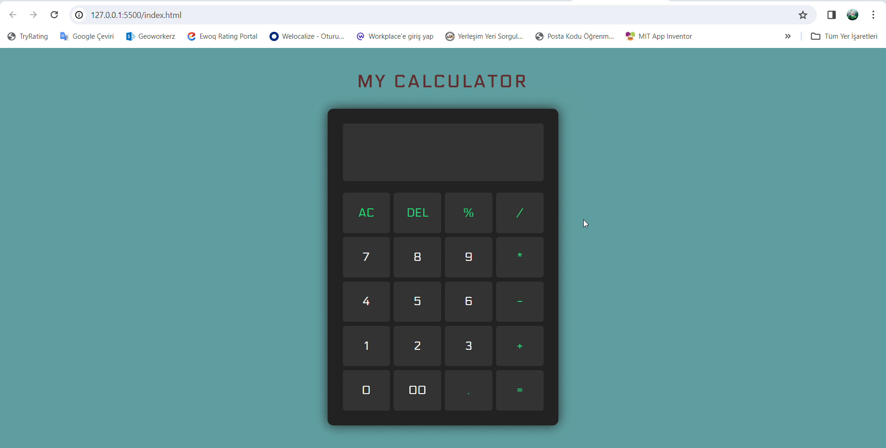

<h1>MY-CALCULATOR</h1>

<h3>Functional Calculator</h3> 

This project is a simple calculator built using HTML, CSS, and JavaScript. The calculator performs basic mathematical operations such as addition, subtraction, multiplication, and division.

<h3> Features</h3>

- Addition
- Subtraction
- Multiplication
- Division

<h3> How to Use</h3>

1. Download or clone the project files to your computer.
2. Open the `index.html` file in your web browser.
3. The calculator interface will appear, ready for immediate use.
4. Enter the desired mathematical operation and see the result.

<h3> Screenshots</h3>

<h3> Contributing</h3>

If you'd like to contribute to the project, please fork it and submit a pull request. We welcome any contributions and suggestions.

